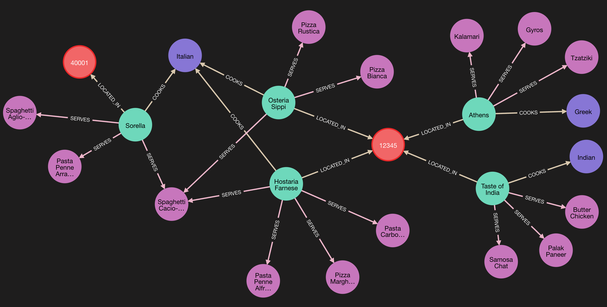

# CD_008 | NoSQL

## Pre Requisites
- Make sure docker desktop is installed on your computer. Don't have it? Check [here](https://www.docker.com/products/docker-desktop/).
No docker knowledge required (only installation). 
- Make sure you are in the **CD_008_NoSQL** directory when executing the commands
  ```shell
  cd CD_008_NoSQL
  ```
  
> In case you're having troubles running the commands, see the [Troubleshooting](#c-troubleshooting) section.

## A. Quick Start

### 1. Start All Databases
The following command will instantiate all the databases contained in the codebase on your local computer. This will
also populate the data in the databases. After running this command, all the databases will be available to connect.
This will enable you to run any commands against the respective databases.
```
docker compose up -d --build
```

### 2. Relational Database (Postgres)
The relational database is populated with data as described in the video. It contains data in both versions;
normalised and de-normalised. To test and run some queries, the following steps can be followed.

- #### 2.1 Connect to Database

    The following command opens a command line interface for you to interact with the postgres database. Once logged in,
    the system will allow you to run queries against the database.

    ```shell
    docker exec -it cd_008_postgres psql -d user_db -U postgres_user -w postgres_pwd
    ```

- #### 2.2 Run Queries

    Once connected to the database, run the queries to get the data as described in the video.
    ```sql
    -- Display Normalized data --
    select * from user_details;
    select * from user_address;
  ```
  
    ```sql
  -- Join tables and display data --
  SELECT 
    ud.ID AS user_id,
    ud.name,
    ud.phone_number,
    ud.email,
    ua.house_number,
    ua.street,
    ua.zipcode,
    ua.is_default
  FROM
    user_details ud
  LEFT JOIN
    user_address ua
  ON
    ud.ID = ua.user_id;
    ```
  
  ```sql
  -- Display Denormalized data --
  select * from denormalized_user_data;
  ```
  
    Other tables present in the relational database for the restaurant recommendations example:
    ```sql
    -- Entity Tables --
    select * from area;
    select * from cuisine;
    select * from dish;
    select * from restaurant;
      
    -- Mapping Tables --
    select * from restaurant_cuisine;
    select * from restaurant_dish;
    ```

    View restaurant recommendations query:
  ```sql
  WITH OsteriaSippi AS (
    SELECT r.id AS restaurant_id, r.rating, a.id AS area_id, c.id AS cuisine_id
    FROM Restaurant r
    JOIN Area a ON r.area_id = a.id
    JOIN Restaurant_Cuisine rc ON r.id = rc.restaurant_id
    JOIN Cuisine c ON rc.cuisine_id = c.id
    WHERE r.name = 'Osteria Sippi'
  ),
  MatchingRestaurants AS (
  SELECT r.id AS restaurant_id, r.name, r.rating, a.zipcode, a.city, c.id AS cuisine_id
  FROM Restaurant r
  JOIN Area a ON r.area_id = a.id
  JOIN Restaurant_Cuisine rc ON r.id = rc.restaurant_id
  JOIN Cuisine c ON rc.cuisine_id = c.id
  JOIN OsteriaSippi os ON r.area_id = os.area_id AND c.id = os.cuisine_id
  WHERE r.rating IN (os.rating + 1, os.rating - 1) AND r.id <> os.restaurant_id
  )
  SELECT mr.name AS restaurant_name, mr.rating, a.zipcode, a.city, c.name AS cuisine_name, d.name AS dish_name, d.description
  FROM MatchingRestaurants mr
  JOIN Restaurant_Dish rd ON mr.restaurant_id = rd.restaurant_id
  JOIN Dish d ON rd.dish_id = d.id
  JOIN Area a ON mr.zipcode = a.zipcode AND mr.city = a.city
  JOIN Cuisine c ON mr.cuisine_id = c.id
  ORDER BY mr.name, d.name;
  ```

- #### 2.3 Exit from psql shell
  To exit from psql shell, simply type **exit** in the psql shell.
  ```
  exit
  ```

### 3. NoSQL: Document Stores (MongoDB)
A mongodb instance with data as described in the video is added to this repository. It contains denormalized data
of users along with their addresses. This mongodb instance can be accessed through command line, through which we can
fetch the data present in the database. 

- #### 3.1 Connect to MongoDB
    This command will connect to mongodb and provide a command line interface to run queries against the data.
    ```shell
    docker exec -it cd_008_mongo mongosh mongodb://localhost/users -u mongo_user -p 'mongo_pwd' --authenticationDatabase admin
    ```

- #### 3.2 Get All Users
    Fetches all the data present in the mongodb for the collections **users**
    ```javascript
    db.users.find();
    ```
  
- #### 3.3 Get a user with ID
    Fetches the user document relative to a particular ID.
    ```javascript
    db.users.find(ObjectId("6666eb769bd64bae84c2d0a9"));
    ```

- #### 3.4 Get a user's default address
  Fetches a user's default address when the user id is present
  ```javascript
  db.users.aggregate([
  {
      "$unwind": "$addresses"
  },
  {
      "$match": {
      "addresses.is_default": true,
      "_id": ObjectId("6666eb769bd64bae84c2d0a9")
      }
  },
  {
      "$replaceRoot": {
      "newRoot": "$addresses"
      }
  }
  ]);
    ```
- #### 3.5 Exit from mongo shell
  To exit from mongo shell, simply type **exit** in the mongo shell.
  ```
  exit
  ```

### 4. NoSQL: Key-Value Stores (REDIS)
A REDIS instance with data as described in the video is added to this repository. It contains key value pairs of data.
As described in the video example - the key is the user key and the value is the default address of that user 
in json format.

- #### 4.1 Connect to REDIS
  This command will connect to REDIS and provide a command line interface to run queries against the data.
    ```shell
    docker exec -it cd_008_redis redis-cli
    ```

- #### 4.2 Display All Keys
  Once redis-cli is accessible, the following command can be used to print all keys present in redis.
    ```shell
    keys *
    ```
  This should print the following:
  ```
  1) "user:d45aa268-3d5a-47d2-8e4c-00085a41d53b"
  2) "user:ec792961-902f-4aa9-9e14-79b873c8cd3c"
  3) "user:0f0365e0-7c5d-4149-9204-09c3199dace3"
  ```
  
- #### 4.3 Get value from a key
  Any of the keys (see [4.2 Display All Keys](#42-display-all-keys)) can be used to get its corresponding value by using the `HGET` command from redis-cli. Example:
  ```
  HGET user:d45aa268-3d5a-47d2-8e4c-00085a41d53b address
  ```
  It should print the following:
  ```json
  "{\"house_number\":\"221B Baker Street\", \"city\":\"London\", \"zipcode\":\"98765\"}"
  ```

- #### 4.4 Exit from redis-cli
  To exit from redis-cli, simply type **exit** in the redis-cli.
  ```
  exit
  ```

### 5. NoSQL: Graph Based Databases (neo4j)
A neo4j instance as a graph based database has been added to this repository. It contains details of different
restaurants, their cuisines, the dishes they serve and the area they are located in. These entities are
connected to each other through a pointing mechanism.

### 5.1 Access via Browser (Recommended)
The neo4j instance can be accessed at the following URL. 
The browser app helps you run queries via the neo4j prompt and also visualises the results in the form of graph in real time.
```
http://localhost:7474/
```
The system will ask for some details and can be logged-into by filling in the following fields:
```
Connect URL: neo4j:// localhost:7686
Database: (leave blank)
Authentication Type: No Authentication
```

### 5.2 Access via Terminal
Alternatively, the neo4j database can also be accessed via terminal by running the following command:
```bash
docker exec -it cd_008_neo4j cypher-shell
```

To exit the cypher-shell, type
```bash
:exit
```

### 5.3 neo4j Query Examples (Cypher)
The neo4j prompt (browser or terminal) can be used to interact with the database through the Cypher Query Language (CQL).
Some Examples are furnished below
- **Read All Data**
  ```cql
  MATCH (n)-[r]->(m)
  RETURN n, r, m
  ```

- **Find Recommendations, When _Osteria Sippi_ is closed**
  ```cql
  MATCH (osteria:Restaurant {name: 'Osteria Sippi'})
  MATCH (osteria)-[:LOCATED_IN]->(area:Area)
  MATCH (osteria)-[:COOKS]->(osteriaCuisine:Cuisine)
  MATCH (dish:Dish {name: 'Spaghetti Cacio-e-Pepe'})
  MATCH (restaurant:Restaurant)-[:LOCATED_IN]->(area)
  WHERE restaurant.rating IN [osteria.rating + 1, osteria.rating - 1] AND restaurant <> osteria
  MATCH (restaurant)-[:COOKS]->(osteriaCuisine)
  MATCH (restaurant)-[:SERVES]->(allDishes:Dish)
  RETURN restaurant, osteriaCuisine AS cuisine, area, collect(allDishes) as dishes
  ```
  Which returns a structure like this:

  

- **Relational DB Query to do the same thing as above**
  First, connect to the postgres shell (psql):
  ```shell
  docker exec -it cd_008_postgres psql -d user_db -U postgres_user -w postgres_pwd
  ```
  Then, run the following query to view the recommendations:
  ```sql
  WITH OsteriaSippi AS (
    SELECT r.id AS restaurant_id, r.rating, a.id AS area_id, c.id AS cuisine_id
    FROM Restaurant r
    JOIN Area a ON r.area_id = a.id
    JOIN Restaurant_Cuisine rc ON r.id = rc.restaurant_id
    JOIN Cuisine c ON rc.cuisine_id = c.id
    WHERE r.name = 'Osteria Sippi'
  ),
  MatchingRestaurants AS (
  SELECT r.id AS restaurant_id, r.name, r.rating, a.zipcode, a.city, c.id AS cuisine_id
  FROM Restaurant r
  JOIN Area a ON r.area_id = a.id
  JOIN Restaurant_Cuisine rc ON r.id = rc.restaurant_id
  JOIN Cuisine c ON rc.cuisine_id = c.id
  JOIN OsteriaSippi os ON r.area_id = os.area_id AND c.id = os.cuisine_id
  WHERE r.rating IN (os.rating + 1, os.rating - 1) AND r.id <> os.restaurant_id
  )
  SELECT mr.name AS restaurant_name, mr.rating, a.zipcode, a.city, c.name AS cuisine_name, d.name AS dish_name, d.description
  FROM MatchingRestaurants mr
  JOIN Restaurant_Dish rd ON mr.restaurant_id = rd.restaurant_id
  JOIN Dish d ON rd.dish_id = d.id
  JOIN Area a ON mr.zipcode = a.zipcode AND mr.city = a.city
  JOIN Cuisine c ON mr.cuisine_id = c.id
  ORDER BY mr.name, d.name;
  ```

- **Delete All Data** 
  ```cql
  MATCH (n)-[r]->(m)
  DELETE n, r, m
  ```
  
  >❗In case you accidentally delete all data, it can be restored by running all the queries present in the 
  > [4_neo4j/data.cql](4_neo4j/data.cql) in the neo4j prompt OR you can simply restart the containers, 
  > which will revert back the data.


### 6. Shut down all databases
Once your testing is complete, the databases can be shut down by using the following command. After this command
is successfully executed, the connections won't work.
```
docker compose down
```
To restart all databases, see [Start All Databases](#1-start-all-databases).
To start only specific databases, see
- [Start Postgres](#11-start-postgres)
- [Start MongoDB](#21-start-mongodb)
- [Start REDIS](#31-start-redis)
- [Start Neo4j](#41-start-neo4j)

## B. Run Individual Databases
The quickstart allows you to start all the databases together for convenience. However - if you wish to start any
individual database and play around with it, you can follow the below instructions.

___

### 1. Only Relational DB : Postgres

* ### 1.1 Start Postgres
  Start a docker container to run postgres. It also initializes the tables and the data as described in the video.
  ```shell 
  docker compose -f ./1_rdbms/docker-compose-pg.yml up -d --build
  ```
  Once postgres starts, the queries can be run against the postgres database as described in the 
[QuickStart](#a-quick-start)/[RelationalDatabase(RDBMS)](#2-relational-database-postgres)

* ### 1.2 Connect to Postgres
  The standalone version's container is named (notice the _standalone at the end): cd_008_postgres**_standalone**

  ```shell 
  docker exec -it cd_008_postgres_standalone psql -d user_db -U postgres_user -w postgres_pwd
  ```

* ### 1.3 Shut down Postgres
  Finally, gracefully shut down postgres docker container.

  ```shell 
  docker compose -f ./1_rdbms/docker-compose-pg.yml down
  ```
___

### 2. Only MongoDB

* ### 2.1 Start MongoDB
  Start a docker container for ONLY for MongoDB. The data will be pre-populated.
   ```shell
  docker compose -f ./2_mongo_db/docker-compose-mongo.yml up -d --build
  ```
  Once mongodb starts, the queries can be run against the mongodb database as described in the
[QuickStart](#a-quick-start)/[NOSQL: Document Stores](#3-nosql-document-stores-mongodb)
    
* ## 2.2 Connect to Standalone MongoDB
   ```shell
    docker exec -it cd_008_mongo_standalone mongosh mongodb://localhost/users -u mongo_user -p 'mongo_pwd' --authenticationDatabase admin
    ```
  Notice the **_standalone** at the end of container name.

* ### 2.3 Shut down MongoDB
  Finally, after testing, gracefully shut down the mongodb docker container.
  ```shell
  docker compose -f ./2_mongo_db/docker-compose-mongo.yml down
  ```

___

### 3. Only REDIS

* ### 3.1 Start REDIS
  Start a docker container for ONLY for REDIS. The data will be pre-populated.
   ```shell
  docker compose -f ./3_redis/docker-compose-redis.yml up -d --build
  ```
  Once redis starts, the commands can be run against redis as described in the
  [QuickStart](#a-quick-start)/[NOSQL: Key-Value Stores (REDIS)](#4-nosql-key-value-stores-redis)

* ### 3.2 Connect to REDIS
  ```shell
  docker exec -it cd_008_redis_standalone redis-cli
  ```
  !Notice the **_standalone** at the end of the container name.

* ### 3.3 Shut down REDIS
  Finally, after testing, gracefully shut down the mongodb docker container.
  ```shell
  docker compose -f ./3_redis/docker-compose-redis.yml down
  ```

___   
        
### 4. NoSQL : Graph Based Databases
This section describes the examples of graph based databases using [neo4j](https://neo4j.com/)

* ### 4.1 Start neo4j
  Start a docker container for neo4j which loads the data into the database as described in the video.
  ```shell
  docker compose -f ./4_neo4j/docker-compose-neo4j.yml up -d --build
  ```

* ### 4.2 Connect to neo4j
  The following command can be used to connect to neo4j's cypher-shell, where the neo4j queries can run. (Similar to how a psql client works)
  
  ```bash
  docker exec -it cd_008_neo4j_standalone cypher-shell
  ```

* ### 4.3 Exit neo4j cypher-shell
  To exit the cypher-shell, use the following command:
  ```bash
  :exit
  ```
___

## C. Troubleshooting
Getting errors? Try these troubleshooting tips.
___
### Qs. Unable to connect with mongodb
On executing the mongo shell command, 
```
docker exec -it cd_008_mongo mongosh mongodb://localhost/users -u mongo_user -p 'mongo_pwd' --authenticationDatabase admin
```
I am getting the following error
```
Current Mongosh Log ID:	6666f70c4d5e1ddaa0c7c0cd
Connecting to:		mongodb://<credentials>@localhost/users?directConnection=true&serverSelectionTimeoutMS=2000&authSource=admin&appName=mongosh+2.1.1
MongoNetworkError: connect ECONNREFUSED 127.0.0.1:27017
```

### Solution
It might mean that your mongodb is still starting up. Try re-executing the command after a few seconds. If it is still
not working, it means something went wrong with the startup.
Go to Docker Desktop -> Containers -> Mongo Container and check the logs for specific errors.
___

### Qs. No such container: cd_008_xxxx
On running the docker exec commands, I am getting the following error:
```
Error response from daemon: No such container: cd_008_postgres
OR
Error response from daemon: No such container: cd_008_mongo
```

### Solution
1. Go to Docker Desktop -> Containers
2. Make sure that the docker compose has successfully started the container
3. If the container is started, check the name of the container by the following command
    ```
    docker ps
    ```
4. This should yield some information like this:
    ```
    CONTAINER ID   IMAGE              COMMAND                  CREATED         STATUS         PORTS                    NAMES
    8938d0087056   1_rdbms-postgres   "docker-entrypoint.s…"   5 minutes ago   Up 5 minutes   0.0.0.0:5432->5432/tcp   cd_008_postgres
    ```
5. Check the last column viz. **NAMES**
6. If it is different from `cd_008_postgres` for postgres and `cd_008_mongo`, copy this name and replace it in the 
docker exec command as follows:
    ```
    docker exec -it <name of the container found above> <rest of the command>
    ```
___

